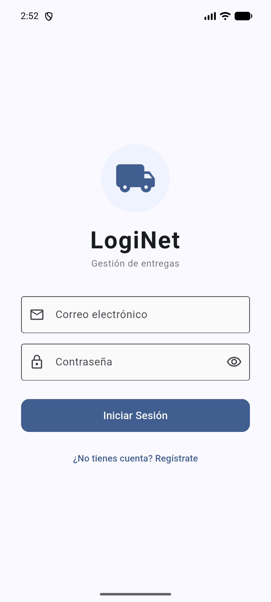
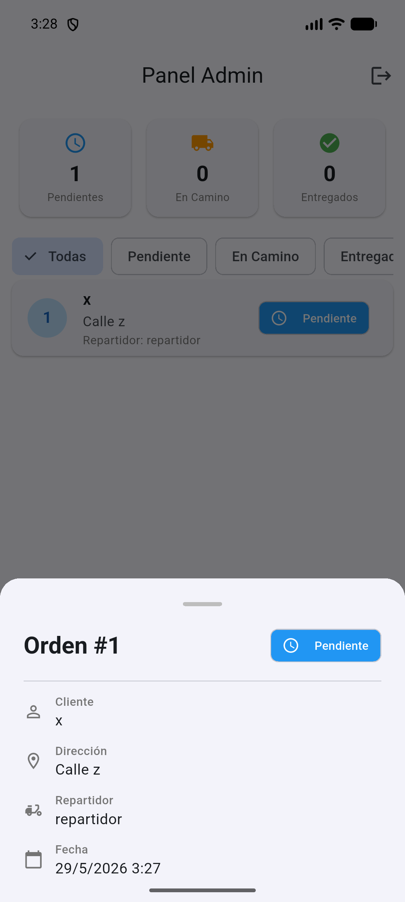
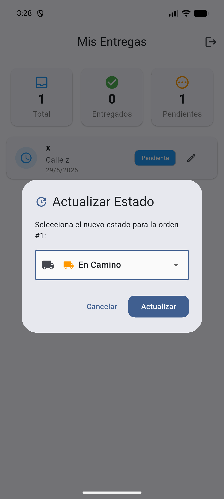

# DevRoute / LogiNet

Sistema de gestión de entregas con autenticación JWT, panel de administración y dashboard para repartidores.

| Login | Panel Admin | Mis Entregas |
|-------|-------------|--------------|
|  |  |  |

## 📋 Requisitos

- [.NET 8 SDK](https://dotnet.microsoft.com/download/dotnet/8.0)
- [Flutter 3.x](https://docs.flutter.dev/get-started/install)
- Emulador Android / iOS o dispositivo físico

## 🚀 Inicio rápido

### 1. Backend (ASP.NET)

```bash
cd loginet-backend
dotnet restore
dotnet run
```

El servidor se inicia en `http://localhost:5207`.

### 2. Frontend (Flutter)

```bash
cd loginet_app
flutter pub get
flutter run
```

## 🔑 Credenciales por defecto

| Rol         | Email              | Contraseña |
|-------------|--------------------|------------|
| Admin       | admin@loginet.com  | admin123   |

Puedes registrar nuevos usuarios desde la pantalla de inicio de sesión.

## 📁 Estructura del proyecto

```
DevRoute/
├── loginet-backend/           # API REST (ASP.NET + SQLite)
│   ├── Data/                  # DbContext y migraciones
│   ├── Models/                # Entidades (Usuario, Orden)
│   ├── Dtos/                  # Objetos de transferencia
│   ├── Services/              # TokenService (JWT)
│   └── Program.cs             # Endpoints minimal API
│
├── loginet_app/               # App móvil (Flutter)
│   └── lib/
│       ├── models/            # Modelos Dart
│       ├── providers/         # Providers (ChangeNotifier)
│       ├── screens/           # Pantallas
│       ├── services/          # ApiService (HTTP)
│       └── utils/             # Constantes
```

## 🧭 Funcionalidades

- **Autenticación JWT** — Login y registro con roles (Admin/Repartidor)
- **Panel Admin** — CRUD de órdenes, asignación a repartidores, estadísticas
- **Dashboard Repartidor** — Lista de entregas asignadas, actualización de estado
- **Búsqueda de repartidores** — Búsqueda por nombre/email al crear órdenes
- **Filtros** — Filtra órdenes por estado (Pendiente, En Camino, Entregado)
- **Detalle de orden** — Modal con información completa
- **Actualización en tiempo real** — Pull-to-refresh en todas las pantallas

## 🔌 API Endpoints

| Método | Ruta                     | Auth    | Descripción                  |
|--------|--------------------------|---------|------------------------------|
| POST   | `/auth/register`         | ❌      | Registrar nuevo usuario      |
| POST   | `/auth/login`            | ❌      | Iniciar sesión               |
| GET    | `/repartidores`          | Admin   | Lista de repartidores        |
| GET    | `/ordenes`               | Admin   | Lista de órdenes             |
| POST   | `/ordenes`               | Admin   | Crear nueva orden            |
| GET    | `/ordenes/mis-entregas`  | Repart. | Órdenes del repartidor       |
| PUT    | `/ordenes/{id}/estado`   | Repart. | Actualizar estado de orden   |
